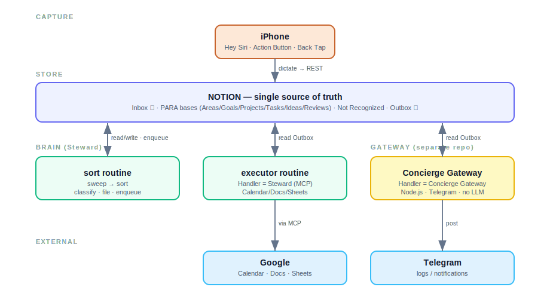

# Steward

**An AI second brain with an action layer — Notion + Claude (+ code).**

Voice notes captured on the phone land in a Notion **Inbox**; a routine sorts them into a typed
Notion structure (PARA); outbound work (calendar, notifications) is queued in an Outbox — connector
actions (Calendar/Docs/Sheets) run in a Claude executor routine via MCP, and a separate gateway
service handles Telegram.

> Status: research/prototype. Built and documented in the open so others can fork and follow.

## How it works (high level)




```
iPhone (Hey Siri "Inbox" / Action Button / Back Tap)
        │  dictate → text on-device
        ▼
Notion Inbox [Status: New]  ──►  Steward routine  ──►  typed Notion bases (PARA)
                                  (sweep → sort)        + Not Recognized (dead-letter)
                                        │  enqueue outbound work (with Handler)
                                        ▼
                                  Outbox queue (Notion)
                                   ├─ Handler=Steward ─► executor routine (MCP) ─► Google Calendar/Docs
                                   └─ Handler=Gateway ─► Concierge Gateway (Node) ─► Telegram
```

Full design, diagrams and data model: [`docs/architecture.md`](docs/architecture.md).

## Repository layout

```
AGENTS.md            # vendor-neutral agent instructions (the operating contract)
CLAUDE.md            # imports AGENTS.md + Claude-specific notes
.claude/
  rules/             # always-loaded rules (taxonomy, conventions)
  skills/            # on-demand procedures (sweep-daily-notes, sort-inbox)
docs/                # architecture, data model, diagrams, iOS shortcut, profile template
.env.example         # required secrets (names only)
```

> **Concierge Gateway** — the Node.js service scoped to **Telegram** (consumes Outbox rows with
> `Handler=Gateway`, posts logs/notifications; receives incoming taps later) — lives in a **separate
> repository**, not here. Connector actions (Calendar/Docs/Sheets) run in the Claude executor
> routine via MCP, not in this service. This repo is the agent's brain (instructions + skills + docs).

> Before first run: copy `docs/profile.template.md` → `docs/profile.md` and fill in your personal
> context. `profile.md` is git-ignored (stays local).

## Two runtimes

This project runs in two phases with different "where the brain lives". Both read this folder
directly — clone the repo, then point the tool at the folder:

1. **Cowork / Claude Desktop (prototype).** Connect the cloned folder as the project. `CLAUDE.md`
   (with its `@AGENTS.md` import) and `.claude/rules/` load automatically at session start.
   Notion is connected via the connector (OAuth) in the UI.
2. **Claude Code / Agent SDK (production, e.g. on a VPS/Raspberry Pi).** Same filesystem
   conventions; `CLAUDE.md`, `.claude/rules/` and `.claude/skills/` are picked up automatically when
   Claude Code runs in this directory.

> **Skills caveat (important).** Claude Code auto-discovers `.claude/skills/` from the project
> folder. **Cowork / claude.ai does *not*** — folder skills are visible as files but are not
> registered as runnable skills, so `bootstrap-notion` etc. won't appear in the skills list. Two ways
> to use them in Cowork:
> 1. **Just ask** — the assistant can read and follow a skill file directly:
>    *"Read `.claude/skills/bootstrap-notion/SKILL.md` and follow it."* (It has the folder + connectors.)
> 2. **Install it** — zip the skill and upload via Settings → Features → Skills:
>    `cd .claude/skills && zip -r bootstrap-notion.zip bootstrap-notion` (repeat per skill).
>
> Verify what's registered by asking *"what skills are available?"*.

## Reuse / quick start

1. Clone this repo and point Cowork (connect folder) or Claude Code at it.
2. Connect the Notion connector, then run the **`bootstrap-notion`** skill to create all bases,
   relations and views automatically (or create them manually per
   [`docs/data-model.md`](docs/data-model.md)). Bootstrap also writes `bases.local.json` (base name →
   data-source ID; git-ignored) — see [`bases.local.example.json`](bases.local.example.json). The
   sort routine reads this registry instead of querying Notion each run.
3. Copy `docs/profile.template.md` → `docs/profile.md` and fill in your context (stays local).
4. Capture: set up the iOS shortcut ([`docs/ios-shortcut-setup.md`](docs/ios-shortcut-setup.md)).
5. `.env` is optional — see [`.env.example`](.env.example). Most secrets live elsewhere (phone
   shortcut / Concierge Gateway repo), not here.

> Instructions (CLAUDE.md / AGENTS.md / rules) load automatically from the connected folder.
> Skills may need verification in Cowork (see caveat above). Connectors, secrets and the Notion
> bases are per-user and set up by whoever forks the repo.

## License

MIT — see [`LICENSE`](LICENSE).
