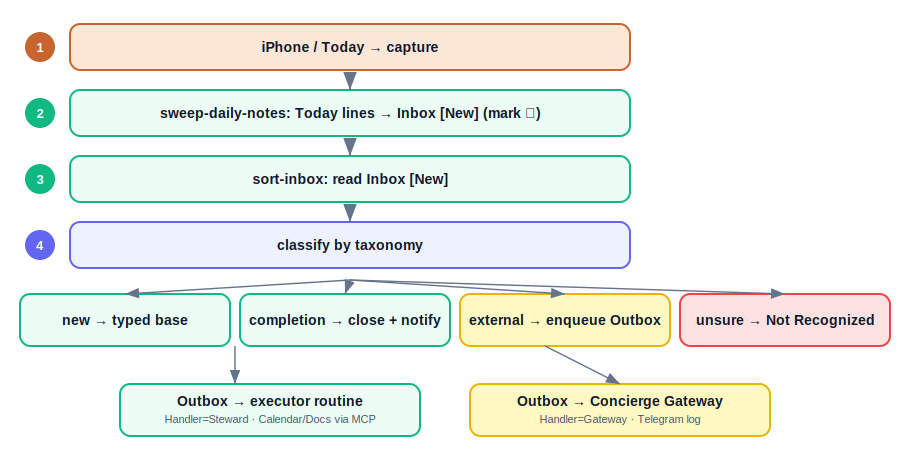
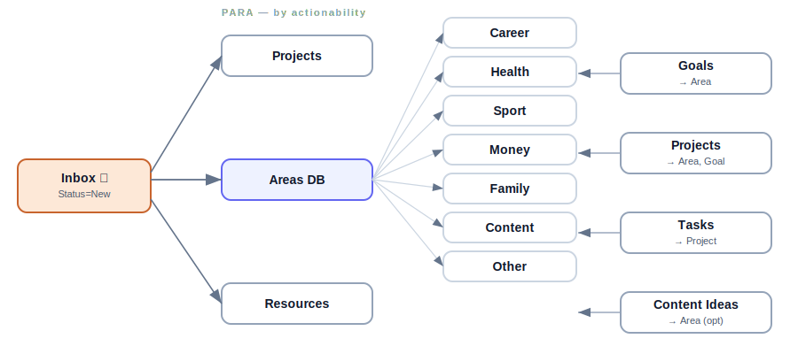

# Steward — Architecture

Canonical design & decision record. Schema lives in [`data-model.md`](data-model.md); diagrams in
[`diagrams/`](diagrams/); taxonomy/conventions in [`../.claude/rules/`](../.claude/rules/).

## 1. What this is

A personal life assistant. Voice notes captured on the phone land in a Notion **Inbox**; a routine
sorts them into a typed Notion structure (PARA); outbound work (notifications + external actions) is
queued in an Outbox and carried out by an executor routine (connectors via MCP) and a Telegram
gateway. A separate read-only advisor ("Curator") is planned on top of the accumulated
context, but is out of scope here.

## 2. Principles

- **Separate capture from processing.** Capture is a dumb append (never breaks). Sorting is a
  deferred batch step done by the agent.
- **The sort routine never executes outbound work.** Internal reversible changes are applied
  silently; anything outbound is enqueued to the Outbox queue for its handler.
- **Notion is the single source of truth.** Records change `Status`; they are never deleted.
- **Not everything goes through the LLM.** Detection, status writes and Telegram I/O are plain code.
  The model is invoked only for classification/sorting.
- **Don't guess.** Ambiguous items go to `Not Recognized` with a reason.
- **Build in vertical slices.** One end-to-end flow working beats ten designed-but-unbuilt blocks.

## 3. Components

| Component | Role |
|---|---|
| **Steward** | The brain. Cowork project (Sonnet): routines sort · executor · digest. Holds structure + rules, not biography. |
| **Concierge Gateway** | Telegram I/O only. Node.js service, 24/7: polls Outbox for `Handler=Gateway` rows, posts logs/notifications (and later receives incoming taps). Notion via REST, no LLM. Separate repo. |
| **Executor routine** | Part of Steward (Claude). Runs connector actions (Calendar/Docs/Sheets/other) for `Handler=Steward` Outbox rows, natively via MCP. |
| **Notion** | Single source of truth: Inbox, typed PARA bases, Not Recognized, Outbox. Shared with partner. |
| **Curator** | Future read-only advisor over `life-context.md`. Out of scope here. |

## 4. Runtime & environment

Two phases, different "where the brain lives":

1. **Cowork / claude.ai project (prototype, now).** Instructions set in the project UI; skills
   uploaded as a zip; runs while the desktop app is open. Draws from the Pro subscription pool.
2. **Claude Code / Agent SDK on a Raspberry Pi (production, 24/7).** Filesystem conventions
   (`CLAUDE.md`, `.claude/`) load automatically. Programmatic calls bill from a separate API credit
   (Anthropic billing change, June 15 2026) — build the Pi phase directly on the Anthropic API.

Token cost falls only on LLM calls (classification, advice). Deterministic code (Notion REST,
Telegram, imports) is token-free. Sorting on Haiku ≈ $0.5–2.5/month; main lever is prompt caching
of the static instructions.

## 5. Capture

Two surfaces, one sort pipeline:

- **Inbox (voice)** — iPhone shortcut writes dictated text to Notion Inbox `Status=New`. Triggers:
  Hey Siri "Inbox", Action Button, Back Tap. On-device Apple STT → text only (no audio, no token
  cost). Setup: [`ios-shortcut-setup.md`](ios-shortcut-setup.md).
- **Daily notes** — free text on the `Today` page (work context, written in the moment). `Today`
  stays a clean work screen; the full Inbox is not shown there.

## 6. The sort pipeline

One routine, two skills, strict order **sweep → then sort** (else sort runs before fresh notes
arrive):

1. **`sweep-daily-notes`** — appends each new Daily-notes line to Inbox `New`, marks the source line
   "✅ done". Idempotency via the ✅ mark is the only defence against duplicates.
2. **`sort-inbox`** — runs after sweep completes. Classifies every Inbox `New` record by the
   taxonomy, routes it, sets `Status=Sorted` + `Target`. Source-independent: everything is just
   Inbox rows by now.

`sort-inbox` also handles **completion notes** — a voice note like "closed task X" / "finished goal
Y" does not create a new record; it matches the existing item and sets it Done. One confident match
→ close it, write the change to the run audit log, and enqueue a `notify` row in **Outbox** (§8) so
the Gateway posts a Telegram log of what changed. No/ambiguous match → Not Recognized (never guess).

Taxonomy + routing map: [`../.claude/rules/taxonomy.md`](../.claude/rules/taxonomy.md).

## 7. Data model

PARA, linked databases (not nested pages). Hierarchy: **Area ⊃ Goal ⊃ Project ⊃ Task** (every level
above Task optional). Inbox is the only generic catch-all; everything downstream is typed. Full
schema: [`data-model.md`](data-model.md).

`Tasks.Executor` (Me / Auto) marks who runs a task. Auto items that touch the external world are
handed off via the **Outbox** queue (§8), not executed silently by the brain.

## 8. Outbox & its two consumers

The **sort** routine never executes outbound work itself — it enqueues it as a row in the **Outbox**
queue with a `Handler`. Two consumers drain the queue, each taking only its rows:

- **Steward executor routine (Handler = Steward (MCP)).** A separate Claude routine that runs
  connector actions — Google Calendar, Docs, Sheets, other — **natively via MCP**. The LLM plus
  native connectors manage these far better than a hand-written service, so calendar/doc/sheet work
  lives here, not in the Node service.
- **Concierge Gateway (Handler = Concierge Gateway).** The always-on Node.js service, **scoped to
  Telegram**: posts logs/notifications now, receives incoming taps later. This is the piece Claude
  can't do natively or 24/7. It talks to Notion via direct REST, no LLM.

Default routing from sort: `notify` → Gateway; `calendar/doc/sheet/other` → Steward executor. Each
consumer reads `Status=Queued AND Handler=<itself>`, performs the action, sets `Done` (or `Failed`).
Notifications are one-way (e.g. "closed goal X"). Two-way **approvals**, if needed later, extend a
row with an approval status — same queue, no new infrastructure. Schema:
[`data-model.md`](data-model.md).

## 9. Model routing

Two tiers: **triage → worker.** Haiku classifies every record and rates complexity. Simple items
are filed inline by code. Heavy items (e.g. "find a recipe and add it Sunday") are queued and a
Sonnet worker handles them with the relevant skills. This avoids paying Sonnet prices for trivial
sorting and keeps context lean. Anything touching the external world is enqueued to the Outbox (§8).

## 10. Roadmap

- **Phase 0** — architecture, diagrams, data model. ✅ (this repo)
- **Phase 1** — capture: iOS shortcut → Inbox.
- **Phase 2** — first sort slice: one record type → tree + Not Recognized. Bar: 9/10 correct.
- **Phase 3** — remaining types, run report, scheduling.
- **Phase 4** — Outbox consumers: executor routine (connector actions via MCP) + Concierge Gateway (Telegram).
- **Phase 5** — digest + Curator advisor.
- **Phase 6** — more domain skills; tune rules from Not Recognized.

## 11. Security

- API keys never enter model context. Notion is via the connector (OAuth); the Telegram token and
  Notion REST token live in the Concierge Gateway repo; the Anthropic key (Pi phase only) in `.env`.
- Notion integration scoped to only the needed databases, not the whole workspace.
- Prompt injection: never act blindly on the content of others' shared-calendar events or external data.
- Irreversible actions run only through the Outbox; add a row-level approval step when you want a
  Telegram confirm-before-execute gate.
